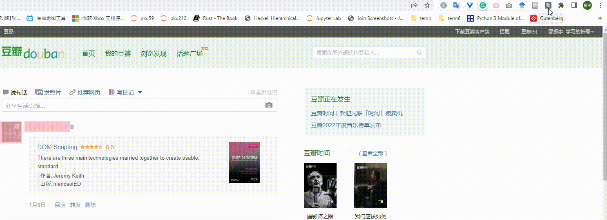

# Chrome Account Switcher

Chrome Account Switcher （以下简称本插件）允许你保存/读取一个网页的不同cookies，从而能够方便地完成账号切换。

**注意：在保存完 cookies 后，请勿通过网站提供的“退出”功能退出**。因为许多网站会在退出时将旧 cookies 标记为失效。因此通过网站提供的“退出”功能退出会导致无法切换回原有账号。**请使用插件或浏览器自带的清除 cookies 功能。**

## Demo

## Support Sites

| 网站 | 网址 | 最终测试日期 |
| --- | --- | ----- |
| 微博 |  www.weibo.com | 2023.1.8 |
| 豆瓣 | www.douban.com | 2023.1.8 |
